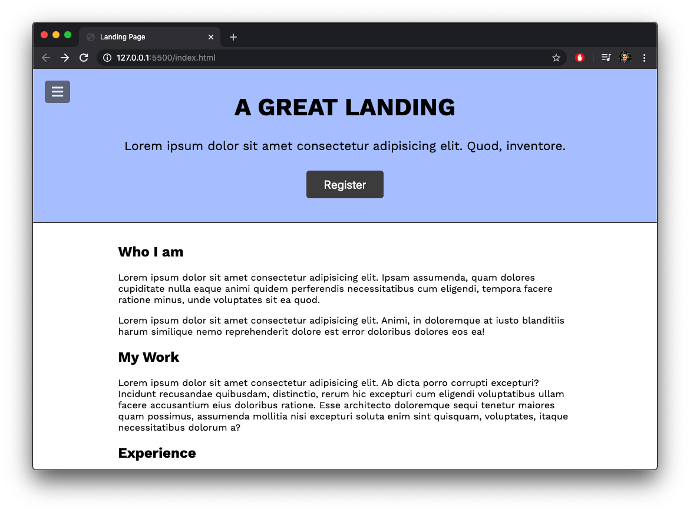
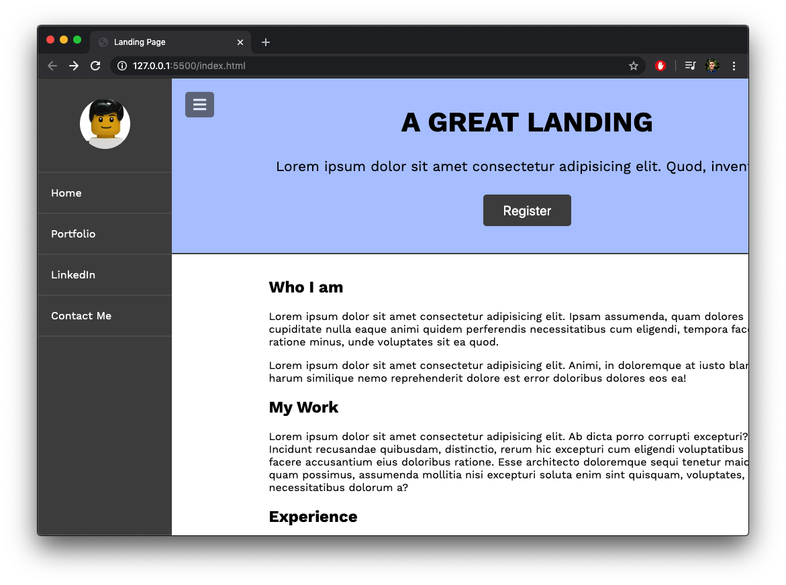
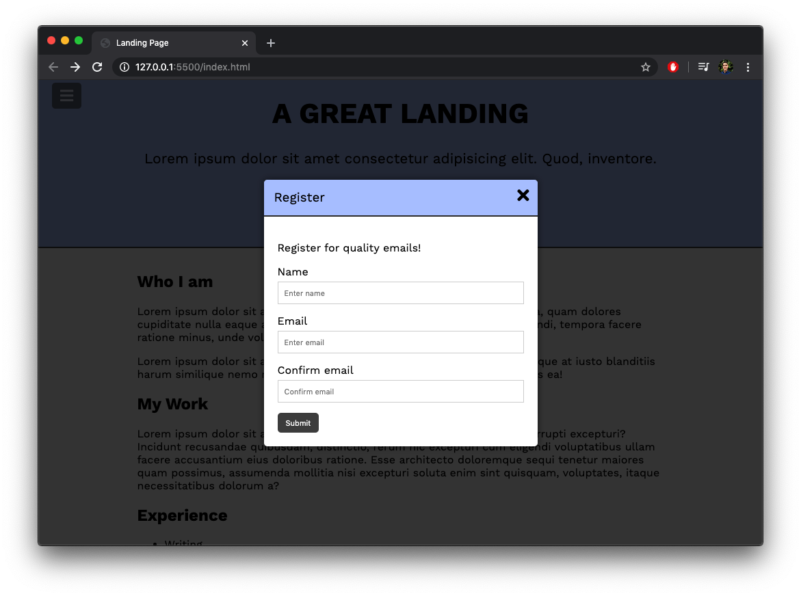

# landingPage: A landing page for persons. 
by mrivasperez 
live demo: <https://mrivasperez.github.io/landingPage/>
## About
I created this landing page template for people to be able to have their portfolio online. It has a very simple, minimalist user interface with an animated navigation bar, module box, and calm blue colors to help people stay on your page. I built it using HTML, CSS, and Vanilla JS.

## Screenshots

>**The main homepage**

>**The navigation sidebar.**

>**The registration modal.**
